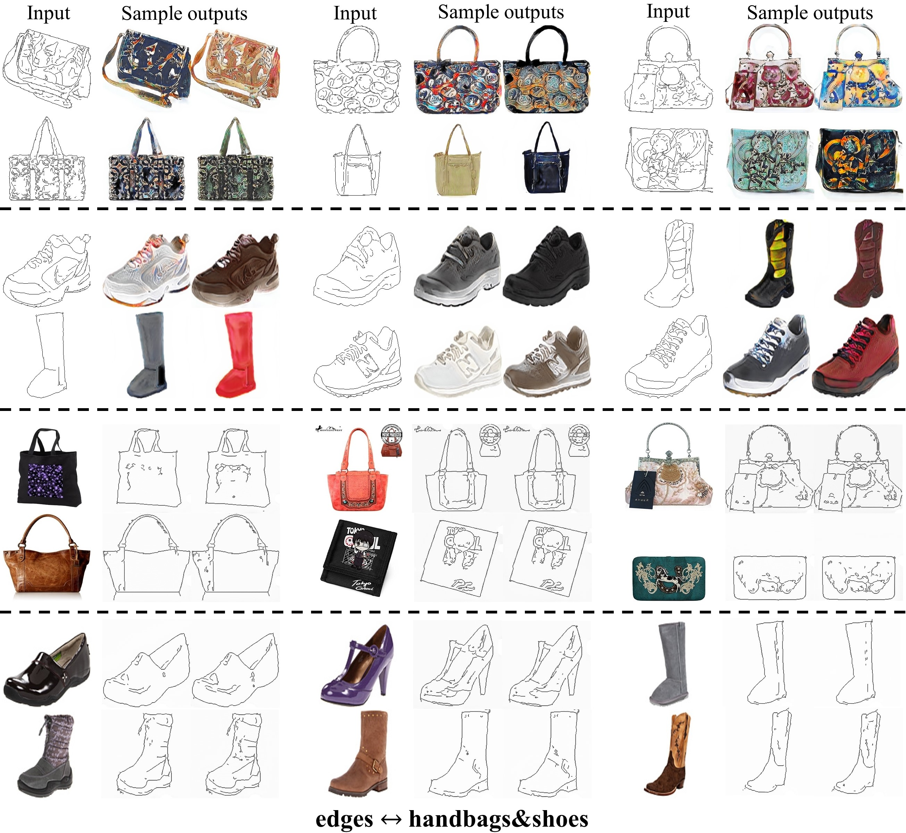

# SoloGAN
[Unsupervised Multimodal Image Translation using a Single Generative Adversarial Network][0]

Our model architecture is defined as depicted bellow, please refer to [the paper][0] for more details:


### Results

Edges ↔ Shoes&handbags:


Horse ↔ Zebra:


Cat ↔ Dog ↔ Tiger:


Leopard ↔ Lion ↔ Tiger:


Photos ↔ Vangogh ↔ Monet ↔ Cezanne:


## Usage Guidance

### Dependencies
1. python 3.x
2. pytorch 4.0+

### Testing

* Downloading the pretrained models and put them in ./checkpoints/ from
[Google Drive](https://drive.google.com/drive/u/1/folders/1ipVSrr-0dAJKqHbqFw7Y8sqfF3GXq5XN) or
[Baidu Yun](https://pan.baidu.com/s/1HixWmTob0uU0TjwZAWqKFg)

* Runing the following command to translate edges to shoes&handbags:
```bash
python ./test.py --name edges_shoes&handbags --d_num 2
```

Then the translated samples are stored in ./checkpoints/edges_shoes&handbags/edges_shoes&handbags_results directory.
By default, it produce 5 random translation outputs.

### Training

* Download the dataset you want to use and move to ./datasets. For example, you can use the horse2zebra dataset provided by [CycleGAN][1].
Please make sure that you have the following directory tree structure in your repository
```
├── datasets
│   └── horse2zebra
│       ├── trainA
│       ├── testA
│       ├── trainB
│       ├── testB
```
The Animals With Attributes (AWA) dataset can be downloaded from [hear][2].
* Start training with the following command:

```bash
python ./train.py --name horse2zebra --d_num 2
```

Intermediate image outputs and model binary files are stored in ./checkpoints/horse2zebra/web

#### bibtex
If this work help to easy your research, please cite the corresponding paper :
```
@inproceedings{huangsologan,
	title={[Unsupervised Multimodal Image Translation using a Single Generative Adversarial Network},
	author={Shihua, Huang and Cheng, He and Yuli, Zhang and Ran Cheng},
	booktitle={},
	year={2019}
 }
 ```

### Acknowledgment

The code used in this research is based on [SingleGAN](https://github.com/Xiaoming-Yu/SingleGAN)

### Concat

Feeling free to reach me if there is any questions <huangsh6@mail.sustc.edu.cn>

[0]: https://arxiv.org/pdf/1901.03353.pdf	"paper"
[1]: https://github.com/junyanz/pytorch-CycleGAN-and-pix2pix "CycleGAN"
[2]: https://cvml.ist.ac.at/AwA2/AwA2-data.zip "AwA2"
